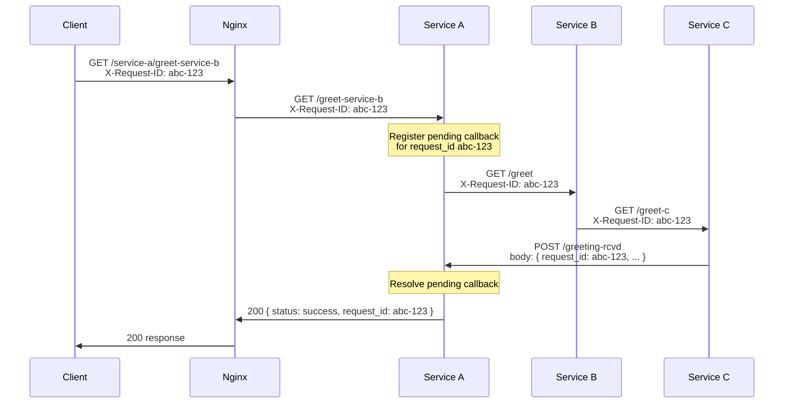

# Nginx Gateway Microservices

A production-style microservice environment: three Node.js HTTP services behind an Nginx reverse proxy, with a full **MELT** observability layer (Metrics, Events, Logs, Traces) using Prometheus, Grafana, Jaeger, Loki, and Promtail.

Only **Service A** is publicly reachable through Nginx. Services B and C are internal infrastructure.

**Runtime:** Docker Compose. **Docker must be installed and running on your machine** before you start the stack. You do not need a VM, or Node.js/Nginx installed on the host — everything runs in containers.

| Host OS | Install Docker |
|---|---|
| macOS | [docs/setup-macos.md](docs/setup-macos.md) |
| Linux | [docs/setup-linux.md](docs/setup-linux.md) |
| Windows | [docs/setup-windows.md](docs/setup-windows.md) |

See [Running with Docker Compose](#running-with-docker-compose) for start commands.

## Quick start

1. Install Docker and ensure the daemon is running.
2. Clone the repository and change into it.
3. Start the stack with `docker compose up --build -d`.
4. Check the public health endpoint at `http://localhost:8080/service-a/health`.
5. Open Grafana at `http://localhost:3030` (login `admin` / `admin`). If port 3030 is busy on your machine, change the host port in `docker-compose.yml` under `grafana.ports`.
6. Run `make test` for application validation and `make melt-test` for observability checks.

## Observability quick start (Saturday demo flow)

Works the same on **macOS, Linux, and Windows** (Docker Desktop required on Mac/Windows).

| Tool | URL | Purpose |
|---|---|---|
| App gateway | http://localhost:8080 | Send requests |
| Grafana | http://localhost:3030 | Operating view (admin/admin) |
| Prometheus | http://localhost:9090 | Metrics and alerts |
| Jaeger | http://localhost:16686 | Distributed traces |
| Loki | http://localhost:3100 | Log API (view in Grafana) |

### 1. Start and verify

```bash
docker compose up --build -d
docker compose ps
curl -fsS http://localhost:8080/service-a/health
```

### 2. Send a successful request

```bash
curl -fsS http://localhost:8080/service-a/greet-service-b -H "X-Request-ID: demo-success-1"
```

### 3. View signals

- **Metrics:** Grafana dashboard **MELT Operating View** or Prometheus graph `rate(http_requests_total[1m])`
- **Traces:** Jaeger → Service `service-a` → Find Traces
- **Logs:** `docker compose logs service-a` or Grafana Explore → Loki → `{service="service-a"}`

### 4. Run load test (one command)

```bash
node scripts/load-test.js
```

On Windows without Node on the host, use Git Bash:

```bash
bash scripts/load-test.sh
```

### 5. Trigger controlled failures

**High latency (lab only):**

```bash
curl -fsS http://localhost:8080/service-a/lab/slow -H "X-Request-ID: demo-slow-1"
```

**High error rate (lab only):**

```bash
curl -fsS http://localhost:8080/service-a/lab/fail -H "X-Request-ID: demo-fail-1"
```

**Service down:**

```bash
docker compose stop service-b
curl -sS -o /tmp/out.json -w "HTTP %{http_code}\n" http://localhost:8080/service-a/greet-service-b
docker compose start service-b
```

### 6. Confirm alerts

Open http://localhost:9090/alerts after a failure. See [Alert reference](#alert-reference) below.

More detail: [docs/architecture.md](docs/architecture.md), [docs/benchmark-report.md](docs/benchmark-report.md), [jaeger/README.md](jaeger/README.md).

## Optional tools added (Loki + Promtail only)

| Tool | Problem it solves | Data collected | Where to view |
|---|---|---|---|
| **Loki** | Central log storage | JSON container logs | Grafana → Explore / dashboard log panel |
| **Promtail** | Ships Docker logs to Loki | stdout/stderr from Compose services | Grafana (via Loki) |

## Alert reference

| Alert | PromQL (summary) | Reproduce | Confirm normal |
|---|---|---|---|
| ServiceDown | `up{job=~"service-*"} == 0` | `docker compose stop service-b` for 1+ min | `docker compose start service-b` |
| HighErrorRate | `rate(http_errors_total[2m]) > 0.1` | `curl localhost:8080/service-a/lab/fail` in a loop or run load-test failure scenario | Stop failure traffic |
| HighLatencyP95 | p95 `http_request_duration_seconds` > 0.5s | `curl localhost:8080/service-a/lab/slow` repeatedly | Stop slow traffic |

Full rules: [alert-rules.yml](alert-rules.yml)


The system demonstrates operational patterns used in production:

- **Container orchestration** — Docker Compose starts all services with restart policies
- **Service discovery** — services communicate by Compose DNS names (`service-a`, `service-b`, `service-c`)
- **Reverse proxy** — Nginx is the sole public entry point
- **Network security** — internal services are reachable only inside the Docker network
- **Dependency management** — Service A waits for B and C to be healthy before starting
- **MELT observability** — Prometheus metrics, Jaeger traces, Loki logs, Grafana dashboard, alert rules

## System architecture

### High-level view

The system is a four-container stack with a public edge network for Nginx and an internal Docker bridge network (`private`) for service traffic. External clients never talk to the microservices directly — all public HTTP traffic enters through Nginx, which forwards only Service A routes. Services A, B, and C exist only on the internal network and are invoked by other containers using Compose DNS names.

```
┌─────────────────────────────────────────────────────────────────────────────┐
│  Host machine                                                               │
│                                                                             │
│   Client ──► localhost:8080 ──► ┌─────────────────────────────────────┐   │
│                                 │  Docker networks: public + private    │   │
│                                 │                                     │   │
│                                 │  ┌─────────┐                        │   │
│                                 │  │  nginx  │ :8080 (only published   │   │
│                                 │  └────┬────┘       host port)       │   │
│                                 │       │ proxy /service-a/*          │   │
│                                 │       ▼                             │   │
│                                 │  ┌───────────┐   ┌───────────┐     │   │
│                                 │  │ service-a │──►│ service-b │     │   │
│                                 │  │  :3001    │   │  :3002    │     │   │
│                                 │  └─────▲─────┘   └─────┬─────┘     │   │
│                                 │        │               │           │   │
│                                 │        │ callback      ▼           │   │
│                                 │        │         ┌───────────┐     │   │
│                                 │        └─────────│ service-c │     │   │
│                                 │                  │  :3003    │     │   │
│                                 │                  └───────────┘     │   │
│                                 └─────────────────────────────────────┘   │
└─────────────────────────────────────────────────────────────────────────────┘
```

| Service | Container port | Host access | Role |
|---|---|---|---|
| Nginx | 8080 | `localhost:8080` | Public reverse proxy — only entry point |
| Service A | 3001 | Via Nginx `/service-a/*` only | Orchestrator — starts the chain, waits for callback |
| Service B | 3002 | Internal network only | Relay — forwards to Service C |
| Service C | 3003 | Internal network only | Processor — completes work and callbacks to A |

### Container startup order

Compose enforces a safe boot sequence so Service A never starts before its dependencies are reachable:

```
service-b ──┐
            ├──► service-a (wait-for-deps.mjs) ──► nginx (waits for A healthy)
service-c ──┘
```

1. **service-b** and **service-c** start first (no inter-dependencies).
2. **service-a** runs `wait-for-deps.mjs`, polling `http://service-b:3002/health` and `http://service-c:3003/health` until both respond (or exits after max retries).
3. **service-a** starts Node and exposes `/health`; Compose healthcheck must pass.
4. **nginx** starts only after Service A is healthy, avoiding 502s on cold boot.

Each container uses `restart: unless-stopped` so the stack recovers automatically after a host reboot unless you explicitly stopped it. Runtime containers also run as non-root users with dropped Linux capabilities and `no-new-privileges`.

### End-to-end request flow

The primary demo route is `GET /service-a/greet-service-b`. It exercises the full chain including an **async callback** — Service A does not return to the client until Service C has called back.



| Step | From → To | HTTP | What happens internally |
|---|---|---|---|
| 1 | Client → Nginx | `GET /service-a/greet-service-b` | Nginx strips `/service-a` prefix, proxies to `service-a:3001/greet-service-b`, sets `X-Request-ID` |
| 2 | Nginx → Service A | `GET /greet-service-b` | A reads or generates `request_id`, stores a pending callback in memory, calls B |
| 3 | Service A → Service B | `GET /greet` | B receives request, forwards to C with same `X-Request-ID` |
| 4 | Service B → Service C | `GET /greet-c` | C processes the greeting, prepares callback payload |
| 5 | Service C → Service A | `POST /greeting-rcvd` | C POSTs JSON with `request_id`; A resolves the pending promise |
| 6 | Service A → Client | `200` JSON | A returns `{ status: "success", request_id }` through Nginx |

A simple health check (`GET /service-a/health`) follows steps 1–2 only and returns immediately without calling B or C.

### Inner workings by component

#### Nginx (gateway)

- Listens on unprivileged container port **8080**; Docker maps it to host **8080**.
- **Only** `location /service-a/` is proxied — all other paths return **404** (including `/service-b/` and `/service-c/`).
- Upstream target: `service-a:3001` via Docker embedded DNS (`127.0.0.11`), re-resolved every 10s.
- Injects `X-Request-ID`: uses the client header if present, otherwise Nginx generates one via `$request_id`.
- Emits structured JSON access logs to **stdout** for `docker compose logs nginx`.

**Nginx upstream DNS caching (Docker).** By default, Nginx resolves upstream hostnames once at startup and keeps that IP. When a container restarts, Docker assigns a new IP — Nginx may still connect to the old address (`connect() failed (111: Connection refused)` in `docker compose logs nginx` → **502 Bad Gateway**). `nginx/nginx-docker.conf` avoids this with:

```nginx
resolver 127.0.0.11 valid=10s ipv6=off;

upstream service_a {
    zone service_a 64k;
    server service-a:3001 resolve;
}
```

After pulling this config, run `docker compose restart nginx` once. Node.js services use `fetch()` and resolve peers on each request — only Nginx needed this fix.

| Symptom | Likely cause |
|---|---|
| **502** after container restart | Nginx hitting stale `service-a` IP, or service-a not running |
| **500** while B is down | Expected — Nginx reached A; A could not reach B |

#### Service A (orchestrator)

- Public-facing application logic; the only service reachable from outside via Nginx.
- **`GET /greet-service-b`** implements an async orchestration pattern:
  1. Creates a `pendingCallbacks` entry keyed by `request_id`.
  2. Starts a 30-second timeout (`CALLBACK_TIMEOUT_MS`).
  3. Calls Service B and **waits** for Service C's callback before responding to the client.
- **`POST /greeting-rcvd`** is the internal callback endpoint — only Service C should call it. It looks up the pending entry and resolves the wait.
- On downstream failure (B unreachable, timeout), returns **500** or **504** with structured `request_failed` logs.

#### Service B (relay)

- Internal-only; forwards `GET /greet` to Service C at `http://service-c:3003/greet-c`.
- Does not implement business logic beyond relaying and logging.
- Returns **500** if C is unreachable.

#### Service C (processor + callback)

- Internal-only; handles `GET /greet-c`.
- After processing, **POSTs back** to Service A at `http://service-a:3001/greeting-rcvd` with `{ request_id, source_service, message, timestamp }`.
- This callback is what unblocks Service A's waiting HTTP handler.

#### Service discovery

Inside containers, peers are reached by **Compose service name** — never `localhost` or the host IP:

| Caller | Resolves to | URL |
|---|---|---|
| Nginx → A | `service-a` | `http://service-a:3001` |
| A → B | `service-b` | `http://service-b:3002` |
| B → C | `service-c` | `http://service-c:3003` |
| C → A (callback) | `service-a` | `http://service-a:3001` |

Docker's embedded DNS on the `private` network maps each service name to the container's current IP. Nginx is attached to both `public` and `private`, but it reaches Service A through `private`. Node.js `fetch` in the services resolves hostnames on each request.

#### Request tracing

A single `X-Request-ID` flows through every hop so one client request can be followed across all logs:

| Hop | Behavior |
|---|---|
| Nginx | `map $http_x_request_id $req_id` — client header or auto-generated |
| Service A | Uses header or generates UUID; forwards to B; includes in callback handling |
| Service B | Forwards same header to C |
| Service C | Forwards same header on callback POST to A |

```bash
curl http://localhost:8080/service-a/greet-service-b -H "X-Request-ID: my-trace-001"
docker compose logs | grep my-trace-001
```

#### Logging

All services use `shared/logger.js` to emit **structured JSON to stdout**. Nginx writes JSON access logs to stdout as well. Nothing important is hidden in files inside containers — use `docker compose logs` to inspect any service.

Example log event:

```json
{"timestamp":"2026-06-25T19:12:09.233Z","service":"service-a","event":"request_forwarded","request_id":"abc-123","path":"/greet-service-b","target":"service-b","status":200}
```

Key `event` values across the flow: `request_received` → `request_forwarded` → `callback_sent` / `callback_received` → `request_completed` (or `request_failed` on error).

### Network isolation

| Access path | Service B | Service C |
|---|---|---|
| From host (`localhost:3002/3003`) | Blocked — port not published | Blocked — port not published |
| From Nginx (`/service-b/`, `/service-c/`) | 404 — no proxy rule | 404 — no proxy rule |
| From inside `private` network | Reachable at `service-b:3002` | Reachable at `service-c:3003` |

This mirrors production patterns: internal services are not exposed to the public internet; only the gateway is.

### Failure and recovery

When Service B is stopped (`docker compose stop service-b`):

1. Service A **stays running** (unlike a systemd `Requires=` coupling).
2. A new `GET /greet-service-b` fails with **500** and `"message": "fetch failed"`.
3. Service A logs `event: request_failed` with the `request_id`.
4. After `docker compose start service-b`, the next request succeeds normally.

Service A also returns **504** if the callback from C does not arrive within 30 seconds (`downstream_timeout`).

## Running with Docker Compose

### Prerequisites

**Docker is required.** Install and start Docker before running any commands below.

| Platform | How to install |
|---|---|
| macOS | [docs/setup-macos.md](docs/setup-macos.md) — Docker Desktop |
| Linux | [docs/setup-linux.md](docs/setup-linux.md) — Docker Engine + Compose plugin |
| Windows | [docs/setup-windows.md](docs/setup-windows.md) — Docker Desktop |

Verify Docker is running:

```bash
docker --version
docker compose version
docker info    # should not error
```

**Supported versions:** Use **Docker Compose V2** (`docker compose`, not the legacy `docker-compose` v1 command). Docker Engine **20.10+** and Compose plugin **2.1+** are recommended — current [Docker Desktop](https://docs.docker.com/desktop/) (macOS/Windows) or [Docker Engine](https://docs.docker.com/engine/install/) (Linux) installs satisfy this. The stack uses `depends_on` with `condition: service_healthy`, which requires Compose V2.1 or newer.

You also need **Git** and **curl** to clone and validate the repository. `make` is optional but recommended for the one-command validation suite. Node.js, Nginx, and a Linux VM are **not** required on the host.

### Start the system

```bash
git clone https://github.com/marybahati/Nginx-gateway-microservices.git Nginx-gateway-microservices
cd Nginx-gateway-microservices
docker compose up --build -d
docker compose ps
```

Expected: four containers running — `nginx`, `service-a`, `service-b`, `service-c`.

Each Node.js service has its own `Dockerfile` under `services/<name>/`. Images use the patch-pinned `node:20.19.5-alpine3.22` base with **no extra OS packages** (`apk` is not required), which avoids Alpine package-index failures on restricted Linux networks during build. The service processes run as the non-root `node` user.

Each Dockerfile runs `npm ci` against that service's `package.json` **`dependencies`** (via `package-lock.json`) — e.g. `express`, `uuid`. There are no `devDependencies` in this project.

### Test the public route

```bash
curl -fsS http://localhost:8080/service-a/health
curl -fsS http://localhost:8080/service-a/greet-service-b
```

For a quick confidence check, run the full validation suite:

```bash
make test
```

### Prove B and C are internal

From the host, direct access to B and C should fail:

```bash
curl -fsS --connect-timeout 3 http://localhost:3002/health >/dev/null 2>&1 && echo "UNEXPECTED: service-b is exposed" || echo "OK: service-b is not exposed"
curl -fsS --connect-timeout 3 http://localhost:3003/health >/dev/null 2>&1 && echo "UNEXPECTED: service-c is exposed" || echo "OK: service-c is not exposed"
```

From inside the network, discovery works:

```bash
docker compose exec service-a node -e "fetch('http://service-b:3002/health').then(r=>r.json()).then(d=>console.log(JSON.stringify(d,null,2)))"
docker compose exec service-b node -e "fetch('http://service-c:3003/health').then(r=>r.json()).then(d=>console.log(JSON.stringify(d,null,2)))"
```

Nginx does not proxy B or C:

```bash
code=$(curl -s -o /dev/null -w "%{http_code}" http://localhost:8080/service-b/health); [ "$code" = "404" ] && echo "OK: service-b route returns 404" || echo "UNEXPECTED: service-b route returned $code"
code=$(curl -s -o /dev/null -w "%{http_code}" http://localhost:8080/service-c/health); [ "$code" = "404" ] && echo "OK: service-c route returns 404" || echo "UNEXPECTED: service-c route returned $code"
```

### View logs

```bash
docker compose logs                     # all services
docker compose logs service-a           # one service
docker compose logs -f                  # follow all
REQUEST_ID=demo-container-001
docker compose logs | grep "$REQUEST_ID"   # trace a request
```

### Stop and restart a service

```bash
docker compose stop service-b
docker compose start service-b
docker compose restart service-a
```

Failure test (stop B, observe error, recover):

```bash
docker compose stop service-b
code=$(curl -sS -o /tmp/service-b-down.json -w "%{http_code}" http://localhost:8080/service-a/greet-service-b -H "X-Request-ID: fail-test-001" || true)
cat /tmp/service-b-down.json; echo
[ "$code" -ge 500 ] && echo "OK: request failed while B is down (HTTP $code)" || echo "UNEXPECTED: request returned HTTP $code"
docker compose logs service-a | grep fail-test-001
docker compose start service-b
curl -fsS http://localhost:8080/service-a/greet-service-b
```

### Shut everything down

```bash
docker compose down
```

### Production compose environment variables

The production compose file expects three variables:

- `DOCKERHUB_USERNAME`
- `APP_NAME`
- `IMAGE_TAG`

Set them before running `docker compose -f docker-compose.prod.yml ...`.

#### macOS & Linux (Bash / Zsh)

Inline one-liner:

```bash
DOCKERHUB_USERNAME=warga24 APP_NAME=devops100 IMAGE_TAG=v1 docker compose -f docker-compose.prod.yml down
```

Persistent session:

```bash
export DOCKERHUB_USERNAME="warga24"
export APP_NAME="devops100"
export IMAGE_TAG="v1"
docker compose -f docker-compose.prod.yml up -d --remove-orphans
```

#### Windows PowerShell

Inline one-liner:

```powershell
$env:DOCKERHUB_USERNAME="warga24"; $env:APP_NAME="devops100"; $env:IMAGE_TAG="v1"; docker compose -f docker-compose.prod.yml down
```

Persistent session:

```powershell
$env:DOCKERHUB_USERNAME="warga24"
$env:APP_NAME="devops100"
$env:IMAGE_TAG="v1"
docker compose -f docker-compose.prod.yml up -d --remove-orphans
```

#### Windows Git Bash / WSL

```bash
DOCKERHUB_USERNAME=warga24 APP_NAME=devops100 IMAGE_TAG=v1 docker compose -f docker-compose.prod.yml down
```

#### Windows Command Prompt (`cmd.exe`)

Inline one-liner:

```bat
set DOCKERHUB_USERNAME=warga24 & set APP_NAME=devops100 & set IMAGE_TAG=v1 & docker compose -f docker-compose.prod.yml down
```

Persistent session:

```bat
set DOCKERHUB_USERNAME=warga24
set APP_NAME=devops100
set IMAGE_TAG=v1
docker compose -f docker-compose.prod.yml down
```

### Makefile shortcuts

```bash
make up          # build and start
make down        # stop and remove
make ps          # container status
make logs        # follow logs
make test        # run application validation (7 tests)
make melt-test   # run observability validation
make restart     # restart all services
```

Full validation evidence: [docs/CONTAINER_VALIDATION.md](docs/CONTAINER_VALIDATION.md)

## Container CI/CD Deployment

### Latest Deployed Version

Commit: `3df3c04fc5e5886462cd43f3e62c7066dbd1e1bd`

Image tag: `v1`

Images:
- `warga24/devops100-service-a:v1`
- `warga24/devops100-service-b:v1`
- `warga24/devops100-service-c:v1`

GitHub Actions runs PR verification on every pull request to `main`: `npm ci`, `npm test`, `npm run build --if-present`, local Docker image builds, `docker compose config`, Compose build, Compose startup, and the Nginx health check. Docker Hub publishing runs only after a successful push to `main`.

Required GitHub settings:
- Repository variable: `DOCKERHUB_USERNAME`
- Repository secret: `DOCKERHUB_TOKEN`

### Deploy

```bash
cp .env.example .env
export DOCKERHUB_USERNAME=warga24
export APP_NAME=devops100
export IMAGE_TAG=v1
./scripts/deploy.sh v1
```

### Verify

```bash
DOCKERHUB_USERNAME=warga24 APP_NAME=devops100 IMAGE_TAG=v1 docker compose -f docker-compose.prod.yml ps
curl -fsS http://localhost:8080/service-a/health
```

Production deployment uses `docker-compose.prod.yml`, which pulls version-tagged images from Docker Hub and does not build locally. Do not deploy `latest`, `main`, or `dev` tags.

`v1` is the latest image tag published to Docker Hub. After committing new source changes, publish images with a new version tag and update this section so the reviewed source state and deployed image tag match exactly.

## API contract

### Service A (`service-a`, port 3001)

| Method | Path | Response |
|---|---|---|
| GET | `/health` | `{ "service": "service-a", "status": "ok", "dependencies": { "service-b": "ok", "service-c": "ok" } }` |
| GET | `/metrics` | Prometheus metrics |
| GET | `/greet-service-b` | `{ "request_id": "...", "status": "success", "message": "Request completed successfully" }` |
| GET | `/lab/slow` | Lab-only — triggers `service-b /slow` |
| GET | `/lab/fail` | Lab-only — triggers `service-c /fail` |
| POST | `/greeting-rcvd` | `{ "status": "received" }` — callback from Service C |

### Service B (`service-b`, port 3002, internal)

| Method | Path | Response |
|---|---|---|
| GET | `/health` | `{ "service": "service-b", "status": "ok", "dependencies": { "service-c": "ok" } }` |
| GET | `/metrics` | Prometheus metrics |
| GET | `/greet` | `{ "request_id": "...", "status": "forwarded", "target": "service-c" }` — requires `X-Request-ID` |
| GET | `/slow` | Lab-only slow endpoint |
| GET | `/fail` | Lab-only error endpoint |

### Service C (`service-c`, port 3003, internal)

| Method | Path | Response |
|---|---|---|
| GET | `/health` | `{ "service": "service-c", "status": "ok", "dependencies": {} }` |
| GET | `/metrics` | Prometheus metrics |
| GET | `/greet-c` | `{ "request_id": "...", "status": "processed", "callback_sent": true }` — requires `X-Request-ID` |
| GET | `/slow` | Lab-only slow endpoint |
| GET | `/fail` | Lab-only error endpoint |

## Repository structure

```
├── .github/workflows/
│   └── container-ci-cd.yml   # PR CI, Compose verification, main-only Docker Hub publish
├── .dockerignore             # Build context exclusions
├── .env.example              # Non-secret production deploy variables
├── alert-rules.yml           # Prometheus alert rules
├── prometheus.yml            # Prometheus scrape config
├── docker-compose.yml        # Local Compose stack with build: entries
├── docker-compose.prod.yml   # Production Compose stack with Docker Hub image: entries
├── grafana/
│   ├── dashboards/           # MELT Operating View dashboard
│   └── provisioning/         # Grafana datasources + dashboard provisioning
├── jaeger/README.md          # Jaeger usage guide
├── loki/loki-config.yml
├── promtail/promtail-config.yml
├── Makefile                  # up, down, test, melt-test, logs, etc.
├── docs/
│   ├── architecture.md       # Request + telemetry flows
│   ├── benchmark-report.md   # Load test results template
│   ├── setup-macos.md
│   ├── setup-linux.md
│   ├── setup-windows.md
│   └── CONTAINER_VALIDATION.md
├── nginx/
│   └── nginx-docker.conf     # Nginx config (public → Service A only)
├── scripts/
│   ├── deploy.sh             # Pull and run a commit-tagged production image set
│   ├── load-test.js          # Repeatable MELT load test (Node)
│   ├── load-test.sh          # Repeatable MELT load test (bash)
│   ├── wait-for-deps.mjs     # Service A dependency health wait (Docker)
│   └── wait-for-deps.sh      # Shell variant (optional reference)
├── shared/
│   ├── logger.js
│   ├── metrics.js
│   ├── middleware.js
│   ├── tracing.js
│   └── health.js
└── services/
    ├── service-a/
    │   ├── Dockerfile
    │   ├── index.js
    │   ├── package.json
    │   ├── package-lock.json
    │   └── test/health.test.js
    ├── service-b/
    │   ├── Dockerfile
    │   ├── index.js
    │   ├── package.json
    │   ├── package-lock.json
    │   └── test/health.test.js
    └── service-c/
        ├── Dockerfile
        ├── index.js
        ├── package.json
        ├── package-lock.json
        └── test/health.test.js
```
