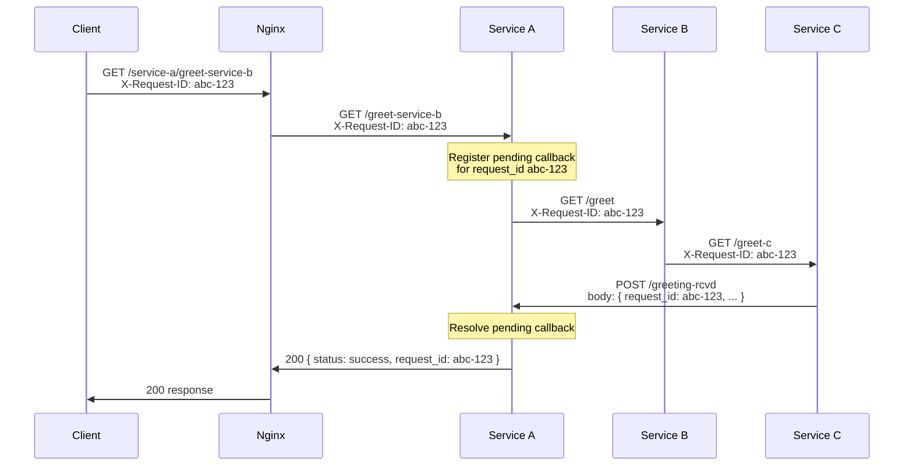

# Nginx Gateway Microservices

A production-style microservice environment: three Node.js HTTP services behind an Nginx reverse proxy, with service discovery, structured logging, request tracing, and network isolation for internal services.

Only **Service A** is publicly reachable through Nginx. Services B and C are internal infrastructure.

**Runtime:** Docker Compose. **Docker must be installed and running on your machine** before you start the stack. You do not need a VM, or Node.js/Nginx installed on the host — everything runs in containers.

| Host OS | Install Docker |
|---|---|
| macOS | [docs/setup-macos.md](docs/setup-macos.md) |
| Linux | [docs/setup-linux.md](docs/setup-linux.md) |
| Windows | [docs/setup-windows.md](docs/setup-windows.md) |

See [Running with Docker Compose](#running-with-docker-compose) for start commands.

## Project overview

The system demonstrates operational patterns used in production:

- **Container orchestration** — Docker Compose starts all services with restart policies
- **Service discovery** — services communicate by Compose DNS names (`service-a`, `service-b`, `service-c`)
- **Reverse proxy** — Nginx is the sole public entry point
- **Network security** — internal services are reachable only inside the Docker network
- **Dependency management** — Service A waits for B and C to be healthy before starting
- **Structured logging** — JSON logs to stdout/stderr, viewable with `docker compose logs`
- **Request tracing** — a single `X-Request-ID` propagates through every hop

## System architecture

### High-level view

The system is a four-container stack on a single Docker bridge network (`gateway`). External clients never talk to the microservices directly — all public HTTP traffic enters through Nginx, which forwards only Service A routes. Services B and C exist on the internal network and are invoked by other containers using Compose DNS names.

```
┌─────────────────────────────────────────────────────────────────────────────┐
│  Host machine                                                               │
│                                                                             │
│   Client ──► localhost:8080 ──► ┌─────────────────────────────────────┐   │
│                                 │  Docker network: gateway              │   │
│                                 │                                     │   │
│                                 │  ┌─────────┐                        │   │
│                                 │  │  nginx  │ :80  (only published   │   │
│                                 │  └────┬────┘       host port)       │   │
│                                 │       │ proxy /service-a/*          │   │
│                                 │       ▼                             │   │
│                                 │  ┌───────────┐   ┌───────────┐     │   │
│                                 │  │ service-a │──►│ service-b │     │   │
│                                 │  │  :3001    │   │  :3002    │     │   │
│                                 │  └─────▲─────┘   └─────┬─────┘     │   │
│                                 │        │               │           │   │
│                                 │        │ callback      ▼           │   │
│                                 │        │         ┌───────────┐     │   │
│                                 │        └─────────│ service-c │     │   │
│                                 │                  │  :3003    │     │   │
│                                 │                  └───────────┘     │   │
│                                 └─────────────────────────────────────┘   │
└─────────────────────────────────────────────────────────────────────────────┘
```

| Service | Container port | Host access | Role |
|---|---|---|---|
| Nginx | 80 | `localhost:8080` | Public reverse proxy — only entry point |
| Service A | 3001 | Via Nginx `/service-a/*` only | Orchestrator — starts the chain, waits for callback |
| Service B | 3002 | Internal network only | Relay — forwards to Service C |
| Service C | 3003 | Internal network only | Processor — completes work and callbacks to A |

### Container startup order

Compose enforces a safe boot sequence so Service A never starts before its dependencies are reachable:

```
service-b ──┐
            ├──► service-a (wait-for-deps.sh) ──► nginx (waits for A healthy)
service-c ──┘
```

1. **service-b** and **service-c** start first (no inter-dependencies).
2. **service-a** runs `wait-for-deps.sh`, polling `http://service-b:3002/health` and `http://service-c:3003/health` until both respond (or exits after max retries).
3. **service-a** starts Node and exposes `/health`; Compose healthcheck must pass.
4. **nginx** starts only after Service A is healthy, avoiding 502s on cold boot.

Each container uses `restart: unless-stopped` so the stack recovers automatically after a host reboot unless you explicitly stopped it.

### End-to-end request flow

The primary demo route is `GET /service-a/greet-service-b`. It exercises the full chain including an **async callback** — Service A does not return to the client until Service C has called back.



| Step | From → To | HTTP | What happens internally |
|---|---|---|---|
| 1 | Client → Nginx | `GET /service-a/greet-service-b` | Nginx strips `/service-a` prefix, proxies to `service-a:3001/greet-service-b`, sets `X-Request-ID` |
| 2 | Nginx → Service A | `GET /greet-service-b` | A reads or generates `request_id`, stores a pending callback in memory, calls B |
| 3 | Service A → Service B | `GET /greet` | B receives request, forwards to C with same `X-Request-ID` |
| 4 | Service B → Service C | `GET /greet-c` | C processes the greeting, prepares callback payload |
| 5 | Service C → Service A | `POST /greeting-rcvd` | C POSTs JSON with `request_id`; A resolves the pending promise |
| 6 | Service A → Client | `200` JSON | A returns `{ status: "success", request_id }` through Nginx |

A simple health check (`GET /service-a/health`) follows steps 1–2 only and returns immediately without calling B or C.

### Inner workings by component

#### Nginx (gateway)

- Listens on container port **80**; Docker maps it to host **8080**.
- **Only** `location /service-a/` is proxied — all other paths return **404** (including `/service-b/` and `/service-c/`).
- Upstream target: `service-a:3001` (Compose DNS, not `localhost`).
- Injects `X-Request-ID`: uses the client header if present, otherwise Nginx generates one via `$request_id`.
- Emits structured JSON access logs to **stdout** for `docker compose logs nginx`.

#### Service A (orchestrator)

- Public-facing application logic; the only service reachable from outside via Nginx.
- **`GET /greet-service-b`** implements an async orchestration pattern:
  1. Creates a `pendingCallbacks` entry keyed by `request_id`.
  2. Starts a 30-second timeout (`CALLBACK_TIMEOUT_MS`).
  3. Calls Service B and **waits** for Service C's callback before responding to the client.
- **`POST /greeting-rcvd`** is the internal callback endpoint — only Service C should call it. It looks up the pending entry and resolves the wait.
- On downstream failure (B unreachable, timeout), returns **500** or **504** with structured `request_failed` logs.

#### Service B (relay)

- Internal-only; forwards `GET /greet` to Service C at `http://service-c:3003/greet-c`.
- Does not implement business logic beyond relaying and logging.
- Returns **500** if C is unreachable.

#### Service C (processor + callback)

- Internal-only; handles `GET /greet-c`.
- After processing, **POSTs back** to Service A at `http://service-a:3001/greeting-rcvd` with `{ request_id, source_service, message, timestamp }`.
- This callback is what unblocks Service A's waiting HTTP handler.

#### Service discovery

Inside containers, peers are reached by **Compose service name** — never `localhost` or the host IP:

| Caller | Resolves to | URL |
|---|---|---|
| Nginx → A | `service-a` | `http://service-a:3001` |
| A → B | `service-b` | `http://service-b:3002` |
| B → C | `service-c` | `http://service-c:3003` |
| C → A (callback) | `service-a` | `http://service-a:3001` |

Docker's embedded DNS on the `gateway` network maps each name to the container's current IP. URLs are set via environment variables in `docker-compose.yml` and read at application startup.

#### Request tracing

A single `X-Request-ID` flows through every hop so one client request can be followed across all logs:

| Hop | Behavior |
|---|---|
| Nginx | `map $http_x_request_id $req_id` — client header or auto-generated |
| Service A | Uses header or generates UUID; forwards to B; includes in callback handling |
| Service B | Forwards same header to C |
| Service C | Forwards same header on callback POST to A |

```bash
curl http://localhost:8080/service-a/greet-service-b -H "X-Request-ID: my-trace-001"
docker compose logs | grep my-trace-001
```

#### Logging

All services use `shared/logger.js` to emit **structured JSON to stdout**. Nginx writes JSON access logs to stdout as well. Nothing important is hidden in files inside containers — use `docker compose logs` to inspect any service.

Example log event:

```json
{"timestamp":"2026-06-25T19:12:09.233Z","service":"service-a","event":"request_forwarded","request_id":"abc-123","path":"/greet-service-b","target":"service-b","status":200}
```

Key `event` values across the flow: `request_received` → `request_forwarded` → `callback_sent` / `callback_received` → `request_completed` (or `request_failed` on error).

### Network isolation

| Access path | Service B | Service C |
|---|---|---|
| From host (`localhost:3002/3003`) | Blocked — port not published | Blocked — port not published |
| From Nginx (`/service-b/`, `/service-c/`) | 404 — no proxy rule | 404 — no proxy rule |
| From inside `gateway` network | Reachable at `service-b:3002` | Reachable at `service-c:3003` |

This mirrors production patterns: internal services are not exposed to the public internet; only the gateway is.

### Failure and recovery

When Service B is stopped (`docker compose stop service-b`):

1. Service A **stays running** (unlike a systemd `Requires=` coupling).
2. A new `GET /greet-service-b` fails with **500** and `"message": "fetch failed"`.
3. Service A logs `event: request_failed` with the `request_id`.
4. After `docker compose start service-b`, the next request succeeds normally.

Service A also returns **504** if the callback from C does not arrive within 30 seconds (`downstream_timeout`).

## Running with Docker Compose

### Prerequisites

**Docker is required.** Install and start Docker before running any commands below.

| Platform | How to install |
|---|---|
| macOS | [docs/setup-macos.md](docs/setup-macos.md) — Docker Desktop |
| Linux | [docs/setup-linux.md](docs/setup-linux.md) — Docker Engine + Compose plugin |
| Windows | [docs/setup-windows.md](docs/setup-windows.md) — Docker Desktop |

Verify Docker is running:

```bash
docker --version
docker compose version
docker info    # should not error
```

**Supported versions:** Use **Docker Compose V2** (`docker compose`, not the legacy `docker-compose` v1 command). Docker Engine **20.10+** and Compose plugin **2.1+** are recommended — current [Docker Desktop](https://docs.docker.com/desktop/) (macOS/Windows) or [Docker Engine](https://docs.docker.com/engine/install/) (Linux) installs satisfy this. The stack uses `depends_on` with `condition: service_healthy`, which requires Compose V2.1 or newer.

You also need **Git** to clone the repository. Node.js, Nginx, and a Linux VM are **not** required on the host.

### Start the system

```bash
git clone <your-repo-url> Nginx-gateway-microservices
cd Nginx-gateway-microservices
docker compose up --build -d
docker compose ps
```

Expected: four containers running — `nginx`, `service-a`, `service-b`, `service-c`.

Each Node.js service has its own `Dockerfile` under `services/<name>/`. Images use the stock `node:20-alpine` base with **no extra OS packages** (`apk` is not required), which avoids Alpine package-index failures on restricted Linux networks during build.

### Test the public route

```bash
curl http://localhost:8080/service-a/health
curl http://localhost:8080/service-a/greet-service-b
```

Or run all checks at once:

```bash
make test
```

### Prove B and C are internal

From the host, direct access to B and C should fail:

```bash
curl --connect-timeout 3 http://localhost:3002/health   # connection refused
curl --connect-timeout 3 http://localhost:3003/health     # connection refused
```

From inside the network, discovery works:

```bash
docker compose exec service-a node -e "fetch('http://service-b:3002/health').then(r=>r.json()).then(console.log)"
docker compose exec service-b node -e "fetch('http://service-c:3003/health').then(r=>r.json()).then(console.log)"
```

Nginx does not proxy B or C:

```bash
curl http://localhost:8080/service-b/health   # 404
curl http://localhost:8080/service-c/health   # 404
```

### View logs

```bash
docker compose logs              # all services
docker compose logs service-a    # one service
docker compose logs -f           # follow all
docker compose logs | grep <request-id>   # trace a request
```

### Stop and restart a service

```bash
docker compose stop service-b
docker compose start service-b
docker compose restart service-a
```

Failure test (stop B, observe error, recover):

```bash
docker compose stop service-b
curl -i http://localhost:8080/service-a/greet-service-b -H "X-Request-ID: fail-test-001"
docker compose logs service-a | grep fail-test-001
docker compose start service-b
curl http://localhost:8080/service-a/greet-service-b
```

### Shut everything down

```bash
docker compose down
```

### Makefile shortcuts

```bash
make up          # build and start
make down        # stop and remove
make ps          # container status
make logs        # follow logs
make test        # run full 7-test validation
make restart     # restart all services
```

Full validation evidence: [docs/CONTAINER_VALIDATION.md](docs/CONTAINER_VALIDATION.md)

## API contract

### Service A (`service-a`, port 3001)

| Method | Path | Response |
|---|---|---|
| GET | `/health` | `{ "service": "service-a", "status": "healthy", "port": 3001, "message": "..." }` |
| GET | `/greet-service-b` | `{ "request_id": "...", "status": "success", "message": "Request completed successfully" }` |
| POST | `/greeting-rcvd` | `{ "status": "received" }` — callback from Service C |

### Service B (`service-b`, port 3002, internal)

| Method | Path | Response |
|---|---|---|
| GET | `/health` | `{ "service": "service-b", "status": "healthy", "port": 3002, "message": "..." }` |
| GET | `/greet` | `{ "request_id": "...", "status": "forwarded", "target": "service-c" }` — requires `X-Request-ID` |

### Service C (`service-c`, port 3003, internal)

| Method | Path | Response |
|---|---|---|
| GET | `/health` | `{ "service": "service-c", "status": "healthy", "port": 3003, "message": "..." }` |
| GET | `/greet-c` | `{ "request_id": "...", "status": "processed", "callback_sent": true }` — requires `X-Request-ID` |

## Repository structure

```
├── docker-compose.yml        # Compose stack definition
├── .dockerignore
├── Makefile                  # up, down, test, logs, etc.
├── docs/
│   ├── setup-macos.md
│   ├── setup-linux.md
│   ├── setup-windows.md
│   └── CONTAINER_VALIDATION.md
├── nginx/
│   └── nginx-docker.conf     # Nginx config (public → Service A only)
├── scripts/
│   ├── wait-for-deps.mjs     # Service A dependency health wait (Docker)
│   └── wait-for-deps.sh      # Shell variant (optional reference)
├── shared/logger.js
└── services/
    ├── service-a/
    │   └── Dockerfile
    ├── service-b/
    │   └── Dockerfile
    └── service-c/
        └── Dockerfile
```
