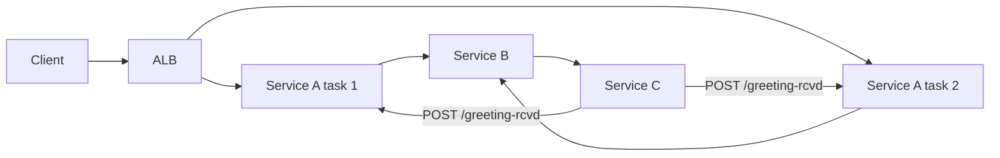

# 02 — Failure map

**User journey:** `GET /greet-service-b` (ALB → A → B → C → callback → A)



## Failure analysis (≥5 components)

| # | Component | What can fail | How we detect it | What absorbs / tolerates | User experience |
|---|-----------|---------------|------------------|--------------------------|-----------------|
| 1 | **ALB / target group** | Targets unhealthy, AZ impairment, listener misconfig | `UnHealthyHostCount` alarm; ALB target health API; shallow health still 200 on other targets | Multi-AZ Service A (2 tasks); circuit breaker on deploy | Intermittent **502/503** or timeouts on greet |
| 2 | **Service A (orchestrator)** | OOM, crash loop, callback wait timeout, wrong replica receives callback | ECS service events; `devops-g5-iac-greet-failures` log metric; p95 latency alarm; `/health` deep check fails | Second A task serves other requests; sticky `X-Callback-URL` prevents callback LB miss | **504** `downstream_timeout` while shallow health green ([golden scar](../aws/docs/golden-scar.md)) |
| 3 | **Service B (relay)** | Cannot reach C, `/fail` path, CPU throttle | B CloudWatch logs `request_failed`; A greet fails; ECS CPU metric | None on greet path — single B task | **500/504** on greet; A logs upstream errors |
| 4 | **Service C (processor + callback)** | Callback to wrong A IP blocked, slow processing, dependency timeout | C logs `callback_sent` without matching A `callback_received`; security group deny shows in VPC flow (if enabled) | Callback timeout on A (30s) | **504** after long wait |
| 5 | **Service Connect / DNS mesh** | Stale peer names in `/etc/hosts` after deploy | Exec into A: `curl service-b:3002/health` fails; mesh refresh `terraform_data` logs | `terraform_data.service_connect_mesh_refresh` force redeploy | Greet fails until mesh refresh |
| 6 | **NAT gateway (egress)** | NAT AZ outage, EIP disassociation | Private tasks lose ECR pull / external fetch; ECS tasks stuck PROVISIONING | None in single-NAT design — lab tradeoff | New deploys fail; existing tasks may run until image pull needed |
| 7 | **Deployment (bad image)** | Broken container on new task def | ECS deployment circuit breaker rollback; pipeline + terraform SHA contract | Automatic rollback to last healthy task def | Brief errors during rollout, then recovery or rollback |

## Detection gaps (pre-production fixes)

1. **NAT single-AZ** — no alarm today; add `ErrorPortAllocation` / NAT gateway metrics or second NAT for prod.
2. **Per-hop latency** — ALB p95 is end-to-end proxy only; add Service Connect or X-Ray for B/C segment SLIs.

## Architecture diagram (ASCII)

```text
Internet
   |
   v
[ ALB :80 ] ----health----> Service A (x2, private subnets, AZ-a + AZ-b)
                               |
                               v
                          Service B (x1)
                               |
                               v
                          Service C (x1)
                               |
                               +--- callback :3001 ---> Service A (task IP via X-Callback-URL)

Security: SG refs only on app ports; no public task IPs; C cannot be reached from A directly.
State: Terraform S3 + DynamoDB lock; immutable ECR SHA tags.
```
